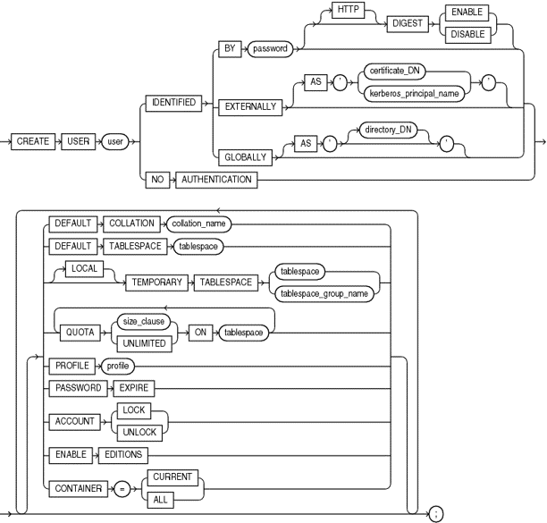
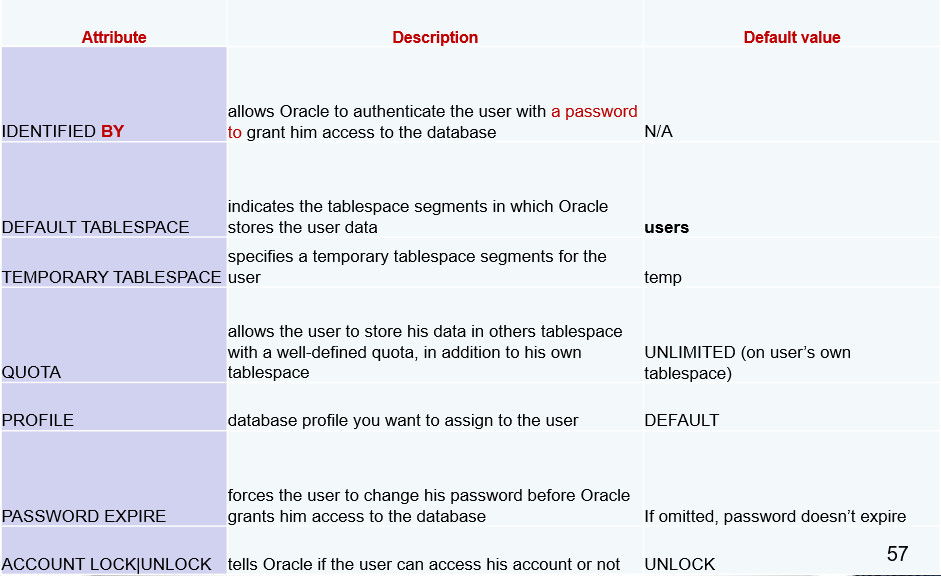
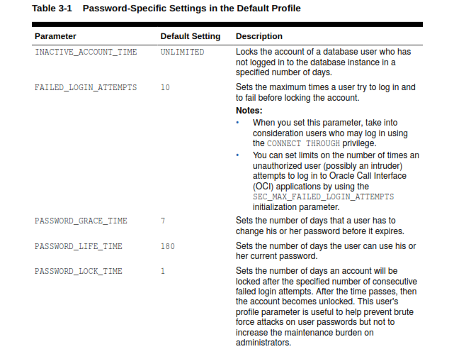
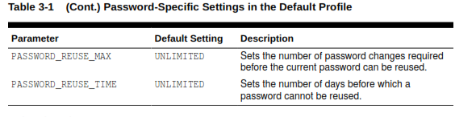
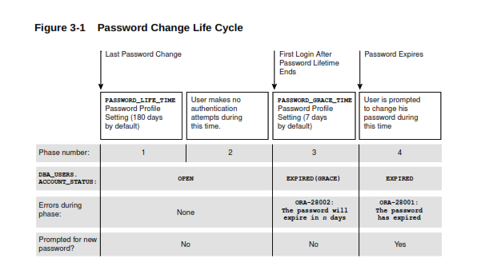
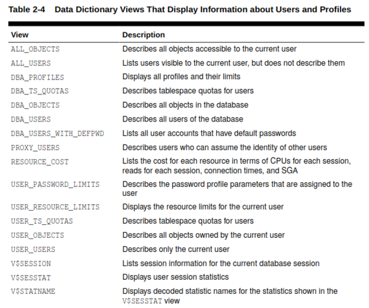
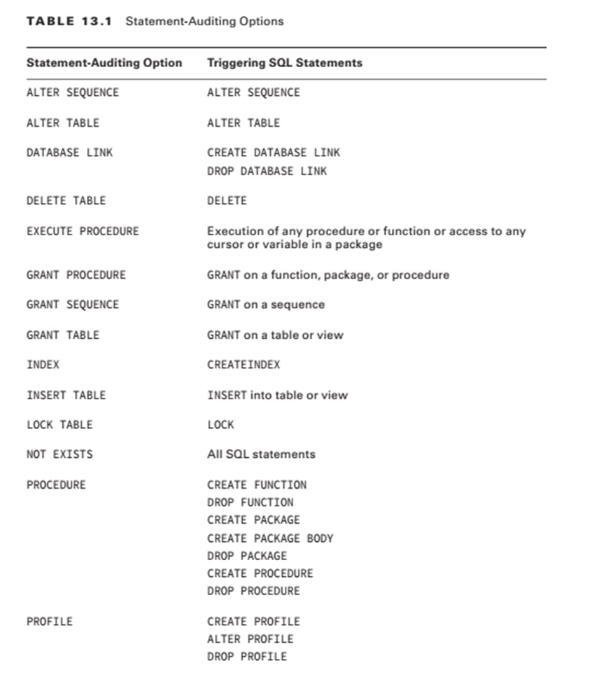
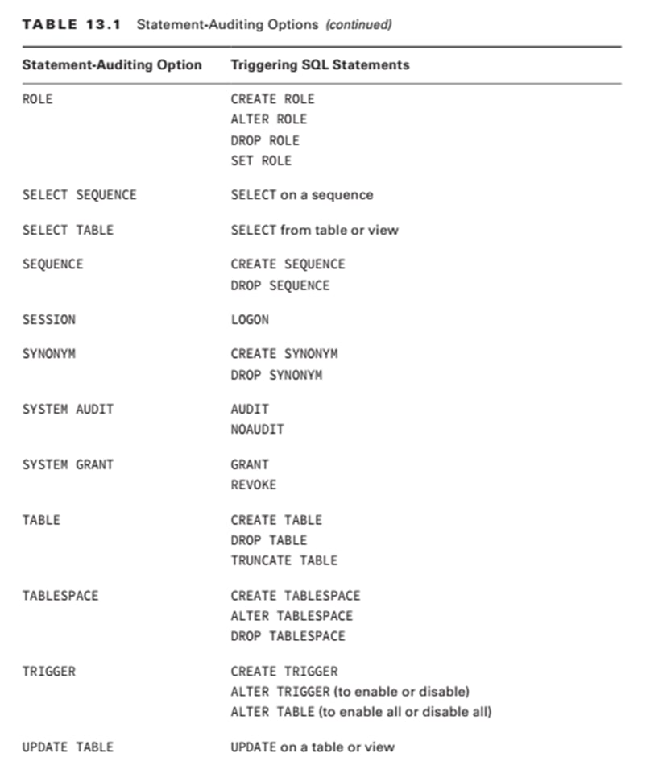
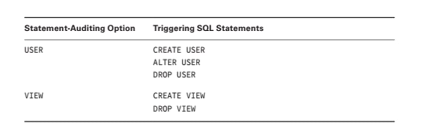

# Oracle Database Security

## Chapter 1

---

## Chapter 2

---

## Chapter 3

---

---

---

# Oracle Database Security - Midterm Exam Revision

## [Doc Link For Important Expected Questions](@https://docs.google.com/document/d/1btVfkwTOQZp7Bl35Zqrf9CXXJqfVdOJ7fJw8E10vhf8/edit?usp=sharing)

### Managing Application Containers & PDBs

> To Connect to the **root CDB** using cmd directly

```sql
sqlplus / as sysdba
```

> Show ALL options available

```sql
show all;
```

> Show ALL PDBs

```sql
SHOW pdbs; -- U must be in DBA user (Like sys)
```

> Show the container name the U currently in

```sql
show con_name;
```

> Show the container ID the U currently in

```sql
show con_id;
```

> Show the current user

```sql
show user;
```

> Show all parameters

```sql
show PARAMETER -- U must be in DBA user (Like sys)
```

> Show specific parameter

```sql
show PARAMETER COMMON_USER_PREFIX
```

> Show All DBA users

```sql
SELECT USERNAME FROM DBA_USERS; -- U must be in DBA user (Like sys)
```

> Show All users

```sql
SELECT USERNAME FROM ALL_USERS;
```

---

> Creating and open an Application Container

```sql
CREATE PLUGGABLE DATABASE appcon1 AS APPLICATION CONTAINER ADMIN USER app_admin IDENTIFIED BY Password1;
-- FILE_NAME_CONVERT=('C:\app\Administrator\oradata\SEC\pdbseed', 'C:\app\Administrator\oradata\SEC\appcon1\’);
ALTER PLUGGABLE DATABASE appcon1 OPEN;
```

> Closing then dropping the Application Container (Same when U need to drop PDB)

```sql
ALTER PLUGGABLE DATABASE appcon1 CLOSE;
DROP PLUGGABLE DATABASE appcon1 INCLUDING DATAFILES; -- PDB or APP must be closed
```

> Switch to the Application container, to be able to create a new Application Pluggable inside it.

```sql
ALTER SESSION SET container = appcon1;
```

> Creating a new pluggable PDB and open it.

```sql
CREATE PLUGGABLE DATABASE apppdb1 ADMIN USER pdb_admin IDENTIFIED BY Password1;
ALTER PLUGGABLE DATABASE apppdb1 OPEN;
```

> Once we create a App PDB, we need to sync it with all Apps int the same App root

```sql
ALTER SESSION SET container = apppdb1; -- switch to the created PDB
ALTER PLUGGABLE DATABASE APPLICATION ALL SYNC; -- PDB must be opened
```

---

### Tablespaces Management

> Creating a tablespace

```sql
CREATE TABLESPACE NAEL_TBS
DATAFILE ‘C:\app\Administrator\oradata\SEC\secpdb\nael_data01.dbf’
SIZE 20M;
```

> Dropping a tablespace

```sql
drop tablespace ts1 including contents
```

> Creating a temporary tablespace
>
> > This type of temporary tablespace contains info that stored until the session is being closed. and the data from some operations such as sorting and joining operations **(ORDER BY, GROUP BY, SELECT DISTINCT, MERGE JOIN, or CREATE INDEX)** will store here in this temp tablespace

```sql
CREATE TEMPORARY TABLESPACE temp1
TEMPFILE ‘C:\app\Administrator\oradata\SEC\temp1.dbf’
Size 50m;
```

> Show default tablespaces for **database**

```sql
SELECT PROPERTY_VALUE FROM DATABASE_PROPERTIES WHERE PROPERTY_NAME = 'DEFAULT_PERMANENT_TABLESPACE';
FILE 'C:\app\Administrator\oradata\SEC\secpdb\nael_data01.dbf'
SIZE 20M;
```

> Show default tablespaces for **user**

```sql
select USERNAME, DEFAULT_TABLESPACE, TEMPORARY_TABLESPACE  from DBA_USERS where USERNAME='NAEL';
```

---

### Managing User Authentication



> Giving nael user a privileges to create a new user

```sql
GRANT CREATE USER TO NAEL WITH ADMIN OPTION;
```

> Creating user syntax
>
> > default tablespace enable you to separate user data and system data

```sql
CREATE USER username
IDENTIFIED BY password
[DEFAULT TABLESPACE tablespace_name]
[TEMPORARY TABLESPACE temp_ts_name]
[QUOTA UNLIMITED|size ON tablespace_name]
[PROFILE user_profile]
[PASSWORD EXPIRE]
[ACCOUNT LOCK|UNLOCK];
```



> Creating user example
>
> > This example creates a local user account and specifies the user password, default tablespace, temporary tablespace where temporary segments are created, tablespace quotas, and profile.

```sql
CREATE USER NAEL
IDENTIFIED BY out_ nael
DEFAULT TABLESPACE NAEL_TBS
QUOTA 10M ON nael_tbs
TEMPORARY TABLESPACE temp1
QUOTA 5M ON users
PROFILE app_user
PASSWORD EXPIRE; -- this will force the user to change this password (we can do this via user profile also)
```

> Granting create session for this new user
>
> > to be able to connect to the DB

```sql
GRANT CREATE SESSION TO NAEL;
```

> Creating a schema only account inside PDB and granting privileges on it.

```sql
alter session set container = secpdb;

create user sales_schema no authentication quota unlimited on users;

grant create session, create table, create sequence, create view to sales_schema ;
```

> Another way for Creating a schema only account (without using no authentication clause)

```sql
drop user sales_schema  cascade; -- drop schema if it exists

create user sales_schema quota unlimited on users;

grant create session, create table, create sequence, create view to sales_schema ;
```

> Assigning tablespace for user that already created

```sql
ALTER USER nael
DEFAULT TABLESPACE NAEL_TBS;
```

> Assigning temporary tablespace for specific user that already created

```sql
ALTER USER temp_user TEMPORARY TABLESPACE temp;
ALTER DATABASE DEFAULT TEMPORARY TABLESPACE temp1; -- Assigning temporary tablespace for any user in the current DB
```

> Assigning Quota for user that already created

```sql
ALTER USER university
QUOTA UNLIMTED ON USERS;
```

> Create and grant privilege to user in one statement

```sql
GRANT CREATE SESSION, CREATE TABLE to USER01 IDENTIFIED BY user;
CONNECT user01/user
CREATE TABLE T1 (C1 NUMBER);
```

---

### Managing User Profiles

> Creating profile syntax
>
> > Profile is a set of limits on the database resources and the user password.
> >
> > > The profile can be applied to multiple users, enabling them to share these attributes. and Different profiles can be assigned to a common user (Common Profile) in the root CDB or Application container, and in a PDB (Local Profile).

```sql
CREATE PROFILE profile_name
LIMIT { resource_parameters | password_parameters};
```





- `INACTIVE_ACCOUNT_TIME` cannot be changed for accounts that authenticate not by password (External & Global User Authn), and its minimum value = 15 days
- If you specify `PASSWORD_LOCK_TIME` as UNLIMITED, then you must explicitly unlock the account by using `ALTER USER NAEL ACCOUNT UNLOCK;`
- A locked CDB common user account will be locked across all PDBs in the CDB. A locked application common user account will be locked across all PDBs that are associated with the application root.

> Example for creating a local profile
>
> > If you are creating a common profile, then you must provide the profile name with the c## prefix (for example, c##password_prof)

```sql
CREATE PROFILE password_prof LIMIT
SESSIONS_PER_USER UNLIMITED
FAILED_LOGIN_ATTEMPTS 6
PASSWORD_LIFE_TIME 60
PASSWORD_REUSE_TIME 60
PASSWORD_REUSE_MAX 5
PASSWORD_LOCK_TIME 1/24
PASSWORD_GRACE_TIME 10
PASSWORD_VERIFY_FUNCTION DEFAULT;
```

> Altering a profile that set time for locking account after exceeding the maximum attempts = 10 Days

```sql
alter profile users_profile limit PASSWORD_LOCK_TIME 10;
```

> Assigning a profile for a user.

```sql
ALTER USER NAEL PROFILE users_profile;
```

> Show all profiles

```sql
select * from DBA_PROFILES;
```

> Show all users & their profiles

```sql
SELECT username, profile FROM dba_users WHERE username = ‘USER02';
```

> Enable pass complexity
>
> > C:\app\db_home\rdbms\admin\catpvf.sql => can be customized to enable password complexity verification. (But U need to run it to create the functions that found inside it)

```sql
GRANT NAEL EXECUTE ON ora12c_strong_verify_function;

ALTER PROFILE password_prof LIMIT
PASSWORD_VERIFY_FUNCTION ora12c_strong_verify_function;

ALTER PROFILE DEFAULT LIMIT PASSWORD_VERIFY_FUNCTION NULL; -- If you need to disable it
```

> To be able to apply a resources restrictions in profile for user(s), U have to enable RESOURCE_LIMIT parameter

```sql
show PARAMETER resource_limit;

ALTER SYSTEM SET resource_limit = TRUE SCOPE = BOTH;
```

> Creating resource limit profile

```sql
CREATE PROFILE app_user LIMIT
SESSIONS_PER_USER          UNLIMITED
CPU_PER_SESSION            UNLIMITED
CPU_PER_CALL               3500
CONNECT_TIME               50
LOGICAL_READS_PER_SESSION  DEFAULT
LOGICAL_READS_PER_CALL     1200
PRIVATE_SGA                20K
COMPOSITE_LIMIT            7500000;
```

- SESSIONS_PER_USER Specify the number of concurrent sessions to which you want to limit the user.
- CPU_PER_SESSION Specify the CPU time limit for a session, expressed in hundredth of seconds.
- CPU_PER_CALL Specify the CPU time limit for a call (a parse, execute, or fetch), expressed in hundredths of seconds.
- CONNECT_TIME Specify the total elapsed time limit for a session, expressed in minutes.
- IDLE_TIME Specify the permitted periods of continuous inactive time during a session, expressed in minutes.
- LOGICAL_READS_PER_SESSION Specify the permitted number of data blocks read in a session, including blocks read from memory and disk.
- LOGICAL_READS_PER_CALL Specify the permitted the number of data blocks read for a call to process a SQL statement (a parse, execute, or fetch).
- PRIVATE_SGA Specify the amount of private space a session can allocate in the shared pool of the system global area (SGA), expressed in bytes.
- COMPOSITE_LIMIT Specify the total resource cost for a session, expressed in service units. Oracle Database calculates the total service units as a weighted sum of CPU_PER_SESSION, CONNECT_TIME, LOGICAL_READS_PER_SESSION, and PRIVATE_SGA.

> Dropping profile
>
> > All users that associated to this profile will assigned automatically to the default profile (can not be dropped)

```sql
DROP PROFILE app_user CASCADE;
```

> `CPU_PER_SESSION` limitation
>
> > This measured in hundredths of a second, and when the resources exceed the limit, the actions that U try to do will rollback and the Exception will be thrown.

```sql
CREATE PROFILE agent LIMIT CPU_PER_CALL 30000;
ALTER PROFILE data_analyst LIMIT CPU_PER_CALL UNLIMITED;
```

> `CONNECT_TIME` limitation
>
> > This measured in minutes of a second, and when the session time exceed the limit, the actions that U try to do will rollback and the session will be terminated.

```sql
CREATE PROFILE agent LIMIT CONNECT_TIME 10;
ALTER PROFILE data_analyst LIMIT CONNECT_TIME UNLIMITED;
```

> Altering user

```sql
alter user khaled
identified by "P@ssw0rd"
default tablespace example
quota 20M on example
profile app_user;
```

> Changing password

```sql
conn khader -- or U can connect to system DBA user, then change the password
password khader; -- Password is hashed, while ALTER USER passes, this will be a clear text.
```

> Unlock user

```sql
alter user khaled account unlock password expire;
```

> Drop user

```sql
select sid, serial#, username from v$session where username=’KHALED’; -- if the user is currently open, U must kill his session
drop user Khaled cascade; -- all of the user’s schema objects are dropped and the schema is deleted from the data dictionary.
```

> Check if the user schema contains object

```sql
SELECT OWNER, OBJECT_NAME FROM DBA_OBJECTS WHERE OWNER LIKE 'NAEL';
```

> Show all tablespaces that assigned to the user

```sql
SELECT * FROM DBA_TS_QUOTAS;
```



> External OS Authn

```sql
CREATE USER ops$nael IDENTIFIED EXTERNALLY;

show parameter os_authent_prefix -- If U  need to show the prefix that used to create external OS authentication account
grant connect to ops$nael;
-- Connecting to this account
connect /
show user -- USER is "OPS$NAEL"
```

---

### SQL injection

> Create a vulnerable stored procedure that insert employee to employees table using execute immediate clause

```sql
CREATE OR REPLACE PROCEDURE insert_emp (
v_employee_id VARCHAR2, v_employee_name VARCHAR2, v_employee_email VARCHAR2,
v_hire_date VARCHAR2, v_salary VARCHAR2)

IS

v_sql VARCHAR2(1000);
begin
v_sql := 'INSERT INTO employees (employee_id, employee_name, employee_email, hire_date, salary) VALUES (' ||
'''' || v_employee_id || ''',' ||
'''' || v_employee_name || ''',' ||
'''' ||  v_employee_email || ''',' ||
'''' || v_hire_date || ''',' ||
'''' ||  v_salary || '' || ')';

execute immediate v_sql;

end;
```

> Granting a privilege to HR user to be able to execute the functions

```sql
grant exec_function to hr;
```

> Inserting via this function

```sql
insert into insert_emp ('212', 'khader', 'khader@gmail.com', '21-9-2000', '3000'); -- normal insert

insert into insert_emp ('212', 'khader''', -- this will give an error because sql injection, to know if there is a SQLi injection or not and to know the database type.
'khader@gmail.com', '21-9-2000', '3000');

insert into insert_emp ('212', ''' (select user from dual)', -- to know the user
'khader@gmail.com', '21-9-2000', '3000');

insert into insert_emp ('212', '(select table_name, rownum as R from USER_TABLES) WHERE R = 2)', -- Making inline view get table name
'khader@gmail.com', '21-9-2000', '3000');


insert into insert_emp ('212', 'khader', 'khader@gmail.com', '21-9-2000', '(select max(salary) from employees)' -- alter the salary to the highest salary
);
```

> Securing the code from SQLi

```sql
CREATE OR REPLACE PROCEDURE insert_emp (
v_employee_id employess.employee_id%type, v_employee_name employess.employee_id%type,
v_employee_email employess.employee_id%type, v_hire_date employess.employee_id%type,
v_salary employess.employee_id%type)

IS

v_sql VARCHAR2(1000);
begin
v_sql := 'INSERT INTO employees (employee_id, employee_name, employee_email, hire_date, salary)
VALUES (:v_employee_id, :v_employee_name, :v_employee_email,
:v_hire_date, :v_salary)';

execute immediate v_sql using v_employee_id,
v_employee_name,
v_employee_email,
v_hire_date,
v_salary;
end;
```

---

---

## Chapter 4

---

## Chapter 5

> The main show command

```sql
SQL> sho parameter audit;
-- NAME                                 TYPE        VALUE
-- ------------------------------------ ----------- ------------------------------
-- audit_file_dest                      string      C:\APP\ADMINISTRATOR\ADMIN\SEC
--                                                  \ADUMP
-- audit_sys_operations                 boolean     TRUE
-- audit_trail                          string      NONE
-- unified_audit_systemlog              boolean     FALSE
```

### Mandatory Auditing

> Show all recorded records
>
> > These stored in AUDSYS schema and SYSAUX tablespace

```sql
select * from unified_audit_trail;
```

> Show the physical location where the audit stored

```sql
sho parameter audit_file_dest;
```

> Enabling and Showing if the additional actions for SYSDBA and SYSOPER is audited

```sql
sho parameter audit_sys_operations;
-- Enables additional auditing of the SYSDBA or SYSOPER actions.
 alter system set audit_sys_operations = true scope=spfile;
```

### Standard Auditing

> Show The standard XML auditing records:

```sql
select * from v$xml_audit_trail;
```

> Disabling AND Enabling Standard Auditing
>
> > The records are sorted in SYS.AUD$

```sql
Show parameter audit_trail;

-- Disable Auditing
  alter system set audit_trail = none  scope= spfile;

--- Enabling either DB or XML auditing.
-- EXTENDED (To records SQL statements and bind variables).
alter system set audit_trail = [db|xml][, extended]  scope= spfile;
-- Restart Database
shutdown immediate;
startup;

-- Sho recoded records
select * from sys.aud$;
```

#### Statement Level

> Enabling and Disabling statement auditing
>
> > Always BY ACCESS

```sql
[NO]AUDIT option [BY user] [BY ACCESS|SESSION] [WHENEVER [NOT] SUCCESSFUL];

AUDIT table;
NOAUDIT table BY hr;
AUDIT table BY hr WHENEVER NOT SUCCESSFUL;
AUDIT table BY hr WHENEVER SUCCESSFUL;
AUDIT INSERT TABLE BY hr BY ACCESS;
```





> Show records happening because specific user

```sql
SELECT username, timestamp, action_name
FROM dba_audit_trail
WHERE username = 'HR';
```

> Show enabled statement audit options

```sql
select * from dba_stmt_audit_opts;
```

#### Privilege Level

> Enabling and Disabling privilege auditing
>
> > Defaults: SYSTEM privilege - By Access

```sql
AUDIT privilege_name [BY username] [by SESSION | ACCESS] [WHENEVER SUCCESSFUL | NOT SUCCESSFUL]

NOAUDIT CREATE SESSION ;
NOAUDIT CREATE SESSION BY HR BY ACCESS;
NOAUDIT UPDATE ANY TABLE  BY HR WHENEVER  NOT SUCCESSFUL;
AUDIT DELETE ANY TABLE BY HR BY ACCESS;
```

> Show enabled privilege audit options

```sql
select * from dba_priv_audit_opts;
```

#### Object Level

> Enabling and Disabling object auditing
>
> > Defaults: SYSTEM privilege - By Access

```sql
AUDIT object_priv_name ON object_name [BY ACCESS | SESSION][WHENEVER SUCCESSFUL|NOT SUCCESSFUL]

AUDIT all ON employees;
AUDIT DELETE ON hr.employees;
AUDIT DELETE ON hr.employees by access;
```

> Show enabled privilege audit options
>
> > - "-" audit option is not set. "S" BY SESSION. "A" BY ACCESS.
> > - Audit option either WHENEVER SUCCESSFUL and WHENEVER NOT SUCCESSFUL

```sql
select * from dba_obj_audit_opts;
```

> Showing auditing records recorded according to specific statement or object or both

```sql
select * from dba_audit_trail WHERE obj_name='EMPLOYEES' AND action_name='DELETE';
```

> Purging the auditing trail

```sql
-- Deleting auditing in the last 90 days
DELETE FROM sys.aud$ WHERE timestamp# < SYSDATE -90;
```

### Value-Based Auditing

> Done by developers Using Triggers
>
> > The addition value of this type that U can save old and new values for any edit

```sql
CREATE OR REPLACE TRIGGER system.hrsalary_audit
AFTER UPDATE OF salary
ON hr.employees
REFERENCING NEW AS NEW OLD AS OLD
FOR EACH ROW
BEGIN
      IF :old.salary != :new.salary THEN
              INSERT INTO system.audit_employees
             VALUES (sys_context('userenv','os_user'), sysdate,
             sys_context('userenv','ip_address’),
             :new.employee_id ||' salary changed from
              '||:old.salary|| ' to '||:new.salary);
END IF;
END;
/
```

### Fine-Grained Auditing (FGA)

> Auditing According to specific conditions (e.g if someone made a query on the manager salary)
>
> > - Working on SELECT + DML (INSERT, UPDATE, DELETE)
> > - On operations happening on table or column inside table
> > - Fist we need to create a policy, then we need to enable it.
> > - U can control policies via package located in SYS schema

```sql
-- To create a new FGA policy, use the packaged procedure DBMS_FGA.ADD_POLICY
-- This procedure has the following parameters:

-- INPUT PARAMETERS
--   object_schema   - schema owning the table/view, current user if NULL
--   object_name     - name of table or view
--   policy_name     - name of policy to be added
--   audit_column    - column to be audited
--   audit_condition - predicates for this policy
--   handler_schema  - schema where the event handler procedure is
--   handler_module  - name of the event handler
--   enable          - policy is enabled by DEFAULT
--   statement_type  - statement type a policy applies to (default SELECT)
--   audit_trail     - Write sqltext and sqlbind into audit trail as well
--                     as destination of audit trail (default DB_EXTENDED)
--   audit_column_options - option of using 'Any' or 'All' on audit columns
--                          for the policy (default ANY)
--   policy_owner    - Owner of FGA policy to be added (default NULL)
```

> Creating a new disabled policy

```sql
DBMS_FGA.ADD_POLICY(object_schema=>'HR',
object_name=>'EMPLOYEES',
policy_name=>'COMPENSATION_AUD',
audit_column=>'SALARY, COMMISSION_PCT',
enable=>FALSE,
statement_types=>'SELECT');

-- Check if it works (Must be not because it is disabled)
SELECT * FROM employees;
```

> Enabling & Disabling disabled policy

```sql
-- Enabling
DBMS_FGA.ENABLE_POLICY(object_schema=>'HR',
object_name=>'EMPLOYEES',
policy_name=>'COMPENSATION_AUD');

-- Check if it works (Must be working because it is now enabled)
SELECT * FROM employees;

-- Disabling
DBMS_FGA.DISABLE_POLICY(object_schema=>'HR',
object_name=>'EMPLOYEES',
policy_name=>'COMPENSATION_AUD');

-- Check if it works (Must be not working because it is now disabled)
SELECT * FROM employees;
```

> Dropping FGA policy

```sql
DBMS_FGA.DROP_POLICY(object_schema=>'HR',
object_name=>'EMPLOYEES',
policy_name=>'COMPENSATION_AUD');
```

> Viewing FGA policies and related info

```sql
-- View all policies
SELECT * FROM dba_audit_policies;

-- Reporting on FGA audit-trail entries
SELECT *
FROM dba_fga_audit_trail
WHERE policy_name='COMPENSATION_AUD’
```

### Unified Auditing

> Enabling & Disabling Unified Auditing

```sql
-- 1- Stopping Lister
lsnrctl stop

-- 2- Stopping DB
shutdown immediate

-- 3- Stopping DB Service (Append UR CDB name)
net stop OracleService~~sec~~

-- 4- Relink Oracle Home Binary:
-- Unix Systems
cd $ORACLE_HOME/rdbms/lib
make -f ins_rdbms.mk uniaud_on ioracle ORACLE_HOME=$ORACLE_HOME
-- Windows Systems
C:\app\db_home\bin\orauniaud.dll.dbl -- Delete .dbl

-- 5- Startup the DB
startup

-- 6- Startup DB Service (Append UR CDB name)
net start OracleService~~sec~~

-- 7- Startup Lister
lsnrctl start

-- 8- Check if the Unified Auditing is enabled
select * from v$option where parameter='Unified Auditing';

-- 9- Disable other auditing mechanisms
alter system set audit_trail = none  scope= spfile;


--- NOTE: Now there are some actions will be audited mandatory without any policy
-- CREATE AUDIT POLICY
-- ALTER AUDIT POLICY
-- DROP AUDIT POLICY
-- AUDIT
-- NOAUDIT
-- EXECUTE of DBMS_FGA
-- EXECUTE of DBMS_AUDIT_MGMT
```

> Showing audited records
>
> > AUD$ and FGA$ tables replaced with one single audit trail table (UNIFIED_AUDIT_TRAIL).

```sql
select * from unified_audit_trail;
```

> Creating audit policy
>
> > U must have AUDIT SYSTEM (system privilege) or AUDIT ADMIN (role)

```sql
CREATE AUDIT POLICY policy_name audit_clauses
[WHEN 'audit_condition'
EVALUATE PER [STATEMENT | SESSION | INSTANCE]]

-- The audit_clauses have different options and syntax based on whether privilege, statement, or role is audited.
-- The audit_condition specifies a condition that determines if the unified audit policy is enforced


CREATE AUDIT POLICY unified_syspriv_1
PRIVILEGES SELECT ANY TABLE, ALTER SESSION;

-- Policy to audit all system and object privileges granted directly to the role resource
CREATE AUDIT POLICY unified_role_audit_1
ROLES resource;


-- Create Multi purpose Policy
CREATE AUDIT POLICY unified_multi_1
PRIVILEGES SELECT ANY TABLE, ALTER SESSION
ACTIONS execute, alter database link
ROLES dba, resource;

CREATE AUDIT POLICY unified_obj1_hr
ACTIONS delete, insert ON hr.departments;

-- Audit datapump export actions
-- RMAN backup, restore, and recover operations are audited by default by the unified audit
CREATE AUDIT POLICY datapump_exp_aud
ACTIONS COMPONENT=datapump export;
```

> Enabling and Disabling Audit Policies

```sql
AUDIT POLICY policy
[ { BY user [, user]... } | { EXCEPT user [, user]... } ]
[ WHENEVER [ NOT ] SUCCESSFUL ]


-- Enabling
AUDIT POLICY  unified_obj1_hr

AUDIT POLICY unified_syspriv_1
BY nael, ahmad WHENEVER NOT SUCCESSFUL;

-- Disabling
NOAUDIT POLICY unified_obj1_hr
```

> Policies Query

```
-- All Predefined Policies
select *
from AUDIT_UNIFIED_POLICIES;

-- Enabled policies
select * from audit_unified_enabled_audit;
```

> Purging Unified Audit Records
>
> > - Unlike SYS.AUD$, UNIFIED_AUDIT_TRAIL cannot be deleted using DML statements.
> > - delete from unified_audit_trail; (Cause ERROR)
> > - Done using using the DBMS_AUDIT_MGMT.CLEAN_AUDIT_TRAIL procedure

```
begin
dbms_audit_mgmt.clean_audit_trail(
audit_trail_type => dbms_audit_mgmt.AUDIT_TRAIL_UNIFIED,
use_last_arch_timestamp => false);
end;
```

> Full Example

```sql
-- Create
CREATE AUDIT POLICY unified_obj1_hr
ACTIONS delete, insert ON hr.departments;

-- Enable
audit policy unified_obj1_hr;

-- Test
Insert into HR.DEPARTMENTS (DEPARTMENT_ID,DEPARTMENT_NAME,MANAGER_ID,LOCATION_ID) values (2000,'Test',null,1700);


-- Check
select *
from unified_audit_trail
WHERE  UNIFIED_AUDIT_POLICIES like '%HR%'


-- Clear

begin
dbms_audit_mgmt.clean_audit_trail(
audit_trail_type => dbms_audit_mgmt.AUDIT_TRAIL_UNIFIED,
use_last_arch_timestamp => false);
end;

-- Disable
noaudit policy unified_obj1_hr;

-- Test and Check again!
```

> Query RMAN operations

```
select *
from UNIFIED_AUDIT_TRAIL
where RMAN_OPERATION is not null;
```

---

## Chapter 6 - Backup and Recovery

### Prerequisites

### 1. Archiving Mode is ON

> Check if Archiving Mode is Enabled:

```sql
ARCHIVE LOG LIST;
-- OR
SELECT dbid, name, created, log_mode FROM v$database;
```

> Enabling Archiving Mode
>
> > 1. Connect sys as sysdba
> > 2. Make sure you are in the root
> > 3. Do this: ARCHIVE LOG LIST; to see if option is enabled or not
> > 4. If not, then:

```sql
Shutdown immediate;
STARTUP MOUNT;
ALTER database archivelog;
ALTER DATABASE OPEN;
ALTER PLUGGABLE DATABASE ALL OPEN;
```

---

### 2. Flash Recovery Area is ON

> Check if Flash Recovery Area is Enabled:

```sql
show parameter db_recovery_file;
-- OR
show parameter db_recovery_file_dest;
-- OR
show parameter db_recovery_file_dest_size;
-- OR
select * from V$RECOVERY_FILE_DEST;
-- OR
select * from v$flash_recovery_area_usage;
```

> Enabling Flash Recovery Area
>
> > 1. Create a Directory
> > 2. Make sure you are in the root
> > 3. Do this: SHOW PARAMETER db_recovery_file; to see if option is enabled or not
> > 4. If not, then:

```sql

alter system set db_recovery_file_dest_size=2G scope=both sid='*';


ALTER SYSTEM SET DB_RECOVERY_FILE_DEST =' C:\app\Administrator\FRA\ ' scope=both sid='*';

alter system set log_archive_dest_1=' LOCATION=C:\app\Administrator\FRA1\ ' scope=both;


-- After enabled Flash Recovery area check the status
select * from v$flash_recovery_area_usage;

-- Switch Archivelog from database level and double check the archivelog
alter system switch logfile;
select dest_name,status,error from v$archive_dest_status;
```

---

## Important Notes

- Inconsistent Backup = Hot Backup = Online Backup
- Consistent Backup = Cold Backup = Offline Backup
- U can perform both (Hot and Cold) if U enabled ARCHIVELOG mode. but if not, U can do Only Cold Backup.
- RMAN is the primary component of the Oracle database used to perform backup and recovery operations.
- You can use RMAN to back up all types: whole or partial databases, full or incremental, and consistent or inconsistent.
- Oracle RMAN (Oracle Recovery Manager) is a utility built into Oracle databases to automate backup and recovery.
- How RMAN works
  - The RMAN environment must include a target database and the RMAN client.
  - It performs backing up, recovering and restoring the database files.
- To perform backup and recovery tasks with RMAN, you must connect to the database as a user with the **SYSDBA** or **SYSBACKUP** privilege.

> Backing Up the Control File
>
> > Before backup you should making multiplexing

```sql
Rman target /
-- RMAN>
BACKUP CURRENT CONTROLFILE;
```

> Backing Up the Database

```sql
Rman target /
RMAN> BACKUP CURRENT CONTROLFILE;
```

---

#### Performing User-Managed Cold Backups

> Cold backups are performed after shutting down the database.

```sql
SHUTDOWN IMMEDIATE or SHUTDOWN TRANSACTIONAL
```

> Copy all control files and data files to another location or to your tape management system using OS commands. You also need to back up the parameter file (init file or spfile) and password file.

```sql
select * from V$CONTROLFILE;
```

---

#### Performing User-Managed Hot Backups

> Before starting to copy the data files belonging to a tablespace, you must place the tablespace in backup mode using the BEGIN BACKUP clause.

```sql
ALTER TABLESPACE users BEGIN BACKUP;
```

> When a tablespace is in backup mode, use OS utilities to copy the data files belonging to the tablespace to another location or to the tape management system.

```sql
ALTER TABLESPACE users END BACKUP;
```
